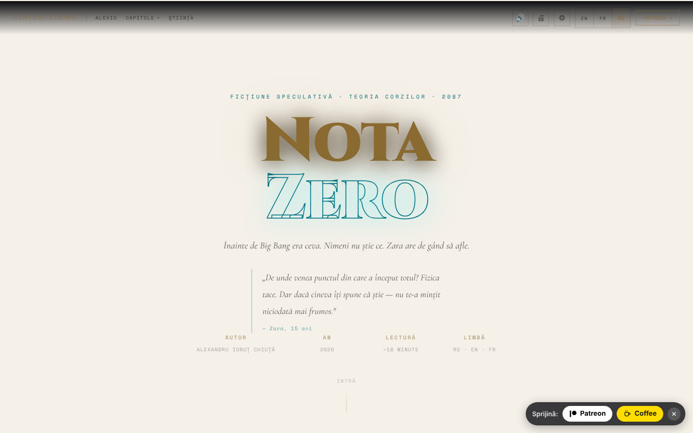

# Nota Zero

**Ficțiune / speculație.** Operă literară; notele științifice au scop explicativ și nu înlocuiesc surse academice.

Povestire de ficțiune speculativă despre teoria corzilor, citibilă în română, engleză și franceză, cu cititor vocal și opțiuni de accesibilitate.

**Live:** https://chiuta.github.io/Nota-Zero/

## Ce este

Nota Zero este o povestire de Alexandru Ionuț Chiuță (2026), prezentată ca o pagină de lectură single-file (`index.html`). Conform paginii, este „ficțiune speculativă · teoria corzilor · 2087”, cu o lectură de aproximativ 18 minute, în trei limbi (RO · EN · FR). Începe cu: „Înainte de Big Bang era ceva. Nimeni nu știe ce. Zara are de gând să afle.” Textul integral este inclus în fișier, alături de note științifice.

## Funcții

- Text complet în română, engleză și franceză; comutare instantanee între limbi.
- Capitole: I · Întrebarea Greșită, Interludiu · Tatăl, II · Muzica Înainte de Sunete, III · Membrana, IV · Înainte de Prima Secundă, V · Corzile, VI · Oglinda Universului, VII · Întoarcerea, Epilog · 17 Mai 2087, plus secțiunea „Note Științifice”.
- Meniu „Capitole” cu navigare directă; buton „↑” pentru revenirea sus; meniu mobil.
- Citire cu voce (🔊) prin sinteza vocală a browserului (Web Speech API): buton ▶ la fiecare capitol, player cu pauză, oprire, salt între fragmente, viteză (1×) și alegerea vocii.
- Imprimare (🖨).
- Panou de accesibilitate (⚙): mărime text (A− / A+), font pentru dislexie (Atkinson Hyperlegible), spațiere litere/cuvinte/rânduri/paragrafe, umbră text, coloană îngustă, subliniere linkuri, contrast ridicat, mod luminos, mod sepia, fără animații, ghid de lectură, moduri pentru daltonism (protanopie, deuteranopie, tritanopie) și „Resetează toate preferințele”.
- Animație de fundal (canvas) în antet, care poate fi dezactivată din „Fără animații”.

## Alte fișiere

- `index.md` — textul poveștii în format Markdown (versiune în română).
- `recenzie.html` — „Recenzie exhaustivă” a lucrării, **generată de un model AI (Claude Sonnet 4.6)**, nu critică literară independentă; scorurile (ex. 9,4/10) sunt generate automat și nu au fost validate de un evaluator uman. Nota este afișată în partea de sus a paginii.

## Manual de utilizare

1. Deschide pagina și alege limba cu butoanele **EN / FR / RO** din bara de sus (sau din meniul ☰ pe mobil).
2. Citește derulând, sau sari la un capitol din meniul „Capitole”; „Știință” duce la „Note Științifice”.
3. Pentru ascultare: apasă 🔊 din bară sau ▶ lângă titlul unui capitol. Cu redarea pornită, **Spațiu** pune pe pauză/reia, iar **Esc** oprește.
4. Din ⚙ Accesibilitate setezi mărimea textului, fontul, spațierea, contrastul, modurile de culoare și altele; preferințele se salvează automat.
5. Folosește 🖨 pentru a imprima textul.
6. În meniurile derulante, săgețile ↑ / ↓ mută selecția, Esc închide, Tab închide meniul.

## Confidențialitate și rețea

- **Stocare locală (localStorage):** limba (`nz-lang`), mărimea textului (`nz-fz`), preferințele de accesibilitate (`nz-a11y-*`, `nz-cb`), viteza și vocea citirii (`nz-tts-speed`, `nz-tts-voice-*`). Nu se stochează textul sau alte date personale.
- **Rețea:** nu am găsit apeluri `fetch`/XHR și nici scripturi sau fonturi încărcate de pe servere externe. Linkurile către centrulstring.ro, alexio.tf, Patreon, Buy Me a Coffee și chiuta.github.io se deschid doar la click.
- Citirea cu voce folosește vocile instalate în browser/sistem; unele browsere pot trimite textul unui serviciu vocal propriu, în funcție de vocea aleasă (comportament al browserului, nu al aplicației).

## Rulare locală / offline

Descarcă `index.html` și deschide-l în browser; textul, accesibilitatea și imprimarea nu au nevoie de internet. Cititorul vocal depinde de vocile disponibile local în browser/sistem.

## Licență

CC0 1.0 Universal (domeniu public) — vezi fișierul LICENSE

## Audit

Audit: 2026-10-10 — fără `fetch`/XHR/CDN; singura ieșire către rețea este la click pe linkuri. Corecturi de accesibilitate (etichete pentru comutatoarele din panoul de accesibilitate, contrast în teme luminoase, panouri cu fundal închis în modul luminos).

## Autor

Alexio — Alexandru-Ionuț Chiuță, contact: alexio@trom.tf. Pagina trimite către Centrul STRING (centrulstring.ro).

## English summary

Nota Zero is a speculative-fiction short story about string theory by Alexandru Ionuț Chiuță, presented as a single-file reading page in Romanian, English and French (about 18 minutes). It has chapter navigation, scientific notes, browser text-to-speech reading, printing and a wide accessibility panel (dyslexia font, spacing, contrast, sepia, colour-blind modes). Preferences are kept in localStorage; no network requests. CC0.
